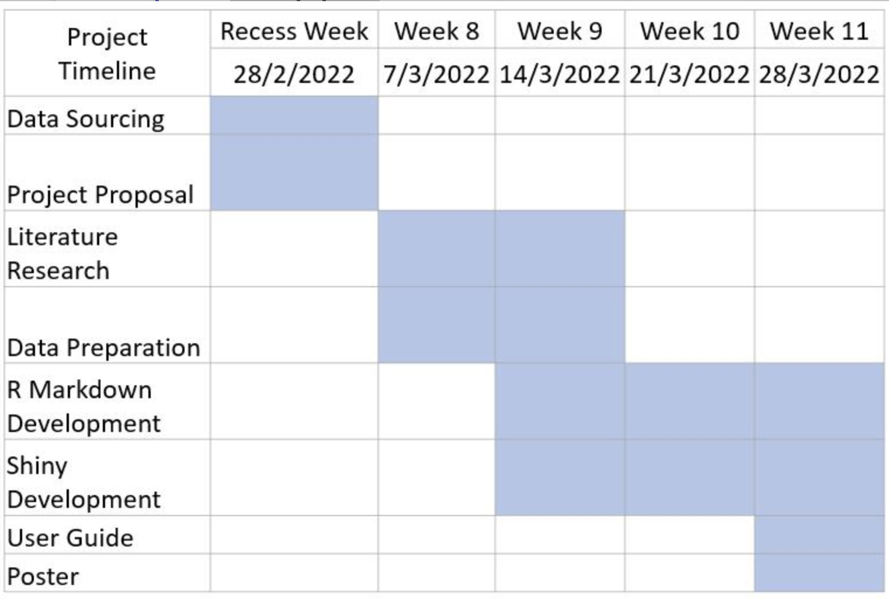

```{r setup, include=FALSE}
knitr::opts_chunk$set(echo = FALSE)
```

# 1 Introduction 

In recent years, there have been high profile cases of public sector procurement fraud and corruption in Singapore, such as that involving Mr Henry Foo Yung Thye, the former Deputy Group Director at the Land Transport Authority (LTA). In this case, various contractors were found to have provided inducements to Mr Foo to advance their business interests with LTA. In another case of procurement fraud, a couple cheated the Ministry of Home Affairs into awarding them a contract. The couple submitted fictitious bids to ensure that their bids were always lowest and selected by MHA. 

Singapore public sector procurement is mainly done via GeBIZ, an e-procurement portal where public agencies publish invitations for quotations and tenders. 

# 2 Motivation  

For public sector procurement, there is a need to identify areas where there is possible over-reliance on a particular supplier. Such over-reliance could point to risks or possible irregularities that would need to be investigated. 

Identifying common procurement needs of various public agencies could also reveal areas for synergy. For example, for goods and services that are required by most agencies, the public sector could call a whole-of-government (WOG) bulk tender, leverage on economies of scale, and thereby procure goods and services at more favourable rates. 

## 2.1 Literature Review 

Currently GeBiz has two separate procurement analytics tools, namely GeBIZ InSIGHT and GeBIZ Management Console (GMC). GeBiz InSIGHT aims at allowing procurement officers to gain insights into the potential procurement opportunities. GeBIZ Management Console (GMC) aims at providing decision makers with visibility of public procurement. Although these tools allow insight gathering for decision making, they are aimed at public sector level. An improvement on this would be making it transparent to the suppliers as well, enabling them to gain insights on potential market opportunities. A single platform consisting analytics targeted at both supplier and public agencies would also improve the procurement efficiencies.

For network data analysis, Sankey diagrams have been used to depict bipartite relationships for advertising expenses by public organisation. To overcome the issue of high number of nodes, hierarchical cluster and filtering were used to provide better visualization.  

Text analytics and cluster analysis have been used to analyse the nature of public sector procurement to identify common goods and services where the procurement could be aggregated. One study noted that opportunities for aggregation were more prevalent in procurement carried out by individual teams.

# 3 Project Objectives

The objective of this project is to provide suitable visualisations for users to:  

**(a)** identify key interactions between public agencies and suppliers 

**(b)** identify key suppliers that are heavily relied on by the public sector 

**(c)** identify the common nature of procurement of each public agency 


# 4 Dataset

The data set is obtained from [Data.gov.sg](https://data.gov.sg/dataset/government-procurement). It contains 32,756 Singapore government procurement records from 2015 to 2021, including 7 variables, namely tender no., tender description, agency, award date, tender detail status, supplier name, and awarded amount.  

# 5 Approach 


The above diagram depicts the team's methodology flow for the project. The aim of this project is not only to focus on the visual elements but also on the analysis. The focus would be to analyse procurement data based on agencies under a particular ministry. For each of the below sections we will explain in detail the individual processes. 


## 5.1 Data Cleaning

Our team first step to the problem is to perform some level of initial data analysis. This would mean that the team will access and observe patterns of the data at first glance. At this stage, the focus is to ensure that data quality and consistency is present. Our team will make use of a number of packages to help perform the cleaning process. The following data wrangling steps would be done: 

* A new variable for “Ministry” would need to be created.  

* Converting the procurement date column into date time object 

This would include namely the following use of these libraries : 

* [**tidyverse**](https://www.tidyverse.org) : A collection of core packages designed for data science in R

* [**readxl**](https://readxl.tidyverse.org) : Package used to make easy to get data out of Excel and into R

* [**dplyr**](https://cran.r-project.org/web/packages/kableExtra/vignettes/awesome_table_in_html.html) : Package used for data manipulation purposes as explained in other take home exercises. 

* [**lubridate**](https://cran.r-project.org/web/packages/lubridate/index.html) : Package used for handling datetime data in R. It provides a number of functions that help with the manipulation of time span objects. 

These packages are preliminary selected as we know that some of these packages would provide the functions in which we need to manipulate and prepare the data for the next section of the project. 

## 5.2 Early Prototypes and Storyboards 

### 5.2.1 Exploratory Data Analytics (EDA) 


Exploratory Data Analysis (EDA) is a crucial step of the process for the sections that follow. In this section the findings from this preliminary analysis would provide the statistical summary and graphical representations of the data main characteristics. It would also help to uncover patterns and anomalies that would require future analysis. 

For EDA, the user would be able to view  

**(a)** a line chart showing the award amount of selected ministry and agency over the years 

**(b)** a bar chart showing the award amount of the top 20 suppliers of selected ministry and agency  
 
**(c)** a treemap that shows the key spenders at ministry and agency level 

**(d)** a bar chart showing the number of tenders who are not awarded of selected ministry  

The user would be able to apply the following selection and filter criteria: 

**(a)** Ministry – filter data of agencies belonging to a particular ministry 

**(b)** Agency – filter data belonging to a particular agency 


## 5.2.2 Network Analysis


Often a times, network analysis is applied to understand social structures. In the context of businesses, it would be used to analyse, control, and monitor business processes and workflow. In the case of our data set, networking analysis can apply to investigate the nature of procurement through the tender structure.  

As each record pertains to a tender job between an agency and a supplier, there exist an interaction between these entities which makes it suitable for some level of network analysis. In this case, our team can understand the more influential nodes and study its structure.  For network analysis, the user would be able to view  

**(a)** a Sankey diagram showing flows of award amounts from agencies to suppliers, and 

**(b)**  a bipartite network chart of agencies and suppliers 

The user would be able to apply the following selection and filter criteria: 

**(c)**  Ministry – filter data of agencies belonging to a particular ministry 

**(d)**  Agency – filter data belonging to a particular agency 

**(e)**  Top Suppliers – filter data belonging to the top input number of suppliers 
**(f)**  Award Period – filter data based on a range of award dates 

**(g)**  Award Amount – filter data based on a range of award amounts 


## 5.2.3 Text mining 


Text mining is often used to derive high quality information from text. This meaning that through text, we can discover hidden trends and patterns that would provide more insights about the context. Often a times, text mining is used to transform large collections of documents to discover new information to help answer specific research or business questions. In our case, much information about what the tender job is about is being left out. In which case, text analysis can be used to understand the nature procurement in terms of its tenders through the tender description. Thus, the team proposes that text mining techniques can be explored in R to analyse the tender description and better understand the nature of procurement. The following visualization would be proposed:  

1. **Tender Description Holistic View**: Build a tag cloud on the tender description to understand the nature of procurement based on different awarded amount categories. A slider bar would be provided to allow users to explore the kinds of frequency of words which will likely represent the kinds of projects at different award amount level. With the addition of a facet grid by groups of different agencies we provide a complementary view of the kinds of projects agencies offer at different amount awarded. The view of a word cloud will allow us to have a visual representation of keywords (tags) used in tender description. In this case, the size of the tags in the visual would represent different levels of importance. The packages explored would include that of [`ggwordcloud`](https://cran.r-project.org/web/packages/ggwordcloud/vignettes/ggwordcloud.html), [`wordcloud`](https://www.rdocumentation.org/packages/wordcloud/versions/2.6/topics/wordcloud) and [`wordcloud2`](https://cran.r-project.org/web/packages/wordcloud2/vignettes/wordcloud.html). 

2. **Tender Description Topic View**: Inspecting the evolution of collection of topics to understand what the kinds of tender jobs are based on the tender description The packages explored would include that of: [`LADVIS`](https://cran.r-project.org/web/packages/LDAvis/index.html). With this, we can map back the topic labels of each record and provide an overview dashboard of the charts to give users a holistic view of the different topics identified. The dashboard thus, would contain statistical summary plots and a filter for date and for topic labels.

3. **Data Complementary view**: show additional plots like bar plots representing the count of the number of jobs tendered by different suppliers for each selected topic, date,awarded amount and agency. The package explored would be that of [`ggplot2`](https://ggplot2.tidyverse.org)

3. For each of these charts, users will be able to drill down to specific topic labels by drop down single selection, different agency entities by drop down single selection and award period and awarded amount slides by slider range selection.  

The sketch of dashboard is as seen below:


For example, users will be able to filter for:
1. A topic (e.g. "Product Support")
2. Agency (e.g. "Ministry of Education")
3. An award period range (e.g. 'Feb 2017 to Feb 2018')
4. An award amount range (e.g. '20 - 30' thousand)

Graphs would represent: 
1. Word cloud pertaining to the ministry tender jobs
2. A distribution of phrases and tags that are identified in more sub topic
3. Distribution of the count of tender jobs by the many different suppliers
 
### 5.2.4 Understanding Term Frequnecy 


The team would also be exploring a couple of different metrics for text representation. The Term frequency is common statistical measure used to understand the frequency of words in a document as seen above. However, there are other metrics like the inverse Term document frequency which is a better statistical measure that takes into account all other documents to see how relevant the words is to a document in a collection of documents as seen below. 


Overall, the team would consider and research upon which metrics would be relevant for our use case. However in order to ultilize this, we will clean the data as follow.

To prepare the data for text visualization, we will need to transform the string of characters into a sequence of tokenised words (tokens). These tokens would represent a unique tag relating to a word n which we can then further process it and transform it to other representations like term frequency or inverse term frequency. In order for a "cleaned" term frequency matrix, we will need to clean the text which involves a series of process as listed :

1. Lower case all words. This will ensure that the case of the text is set to a standard as R is case sensitive 

2. Remove all numbering, punctuation and keep only lower case characters. This removes all symbols and space from the list of words

3. Remove all the stop words from the list of words. Stop words are not useful when it comes to analysis because they usually represent a bunch of common words used in the language in general. In the case of different domains, stop word list changes depending on the context and what is deemed as useful or too generic words. 

4. It would be good practice to apply stemming. Stemming is the process of finding the root word which can aid in the pre-processing process like the formation of document term frequency matrix. The reason for this is that stemming removes the derivation and inflectional affixes of words tat can help to improve the performance of models. 

## 5.3.3 Text Analysis: Updated Sketch

The updated text mining sketch includes the creation of three new tabs. The three newly created tabs are : 

- A Agency View : Tender Projects by Agency
    + Purpose For this dashboard, users will be to investigate the agency tender projects – reflecting their needs by specific time periods and in specific project types. As such, it serve for users that can investigate the change in agency needs over time and allow users (government agencies) to understand changing needs of the different ministries​


- A Supplier View : Tender Projects by Supplier 
    + ​The insights from this dashboard would be vastly different from the tender projects by agency. The reason is because, being able to filter by supplier, the analysis would be viewing the kinds of projects done by specific supplier by specific date range. Users can view the kinds of projects through word cloud frequency, agencies suppliers have worked with before and their respective award number of different tenders and the raw data view. This will allow for drill down to the nature of a particular supplier. For example, agencies might be looking to work with a supplier from the list of suppliers they have never worked with before. If the supplier is listed in the filter, the user can filter for the supplier and view those details which will help guide their decision. It will help them decide if the supplier deals in the same area of projects and if it is suitable for their project needs. ​


- A Topic Model view : Topic Modelling of Tender Description (keywords by LDA)
    + The point of this dashboard is for a transparent visualization on how project types are named. This will help in cohesive decisions on what the different project areas are (an unsupervised data driven approach to identify topic areas). ​


# 6 Team Timeline 



# 7 Software Tool and R Packages 

The primary tool we will use for the project is R using RStudio. The following are the R packages used:  

- [R shiny](https://shiny.rstudio.com ) : This package allows users to interact with data and analysis. 

- [tidyverse](https://www.tidyverse.org/) : This is a collection of R packages designed for data science. 

- [dplyr](https://dplyr.tidyverse.org/) : This package provides a consistent set of verbs to perform data manipulation. 

- [lubridate](https://www.rdocumentation.org/packages/lubridate/versions/1.8.0) – This package makes it easier to work with date-times in R. 

- [ggbipart](https://cran.r-project.org/web/packages/bipartite/): This package is used to visualise webs, with focus on webs consisting of 2 levels (bipartite). 

- [networkD3]( https://cran.r-project.org/web/packages/networkD3/networkD3.pdf) : This package creates D3 JavaScript network, tree, dendrogram, and Sankey graphs from R. 

- [ggplot2](https://ggplot2.tidyverse.org/): This package is used for creating graphics such as bar chart and line graphs 

- [d3treeR](https://cran.r-project.org/web/packages/d3Tree/index.html): This package is used in conjunction with “treemap” package to create and customize interactive treemaps 

- [treemap]( https://cran.r-project.org/web/packages/treemap/index.html): This package is used as a space-filling visualization of hierarchical structures. 

- [`LADVIS`](https://cran.r-project.org/web/packages/LDAvis/index.html). This package provides a way to build a topic model visualisation 

- [`ggwordcloud`](https://cran.r-project.org/web/packages/ggwordcloud/vignettes/ggwordcloud.html). This package provides a way to build word cloud text geom for ggplot2.

- [`wordcloud`](https://www.rdocumentation.org/packages/wordcloud/versions/2.6/topics/wordcloud) & [`wordcloud2`](https://cran.r-project.org/web/packages/wordcloud2/vignettes/wordcloud.html). These are also word cloud generation packages. The differene between `wordcloud` and `wordcloud2` is that `wordcloud2` interfaces with html 5.

- [tidytext](https://cran.r-project.org/web/packages/tidytext/vignettes/tidytext.html). This package support functions and supporting data sets to allow conversion of text to and from tidy formats. This can be accompanies with other packages that provide text mining operations like [`tm`](https://www.rdocumentation.org/packages/tm/versions/0.7-8) which will be explored.

# 8 Deliverables  

The output from the project will be: 

1. **An interactive R Shiny dashboard**: For users to have an overview of government procurement nature and interactions between public sector and suppliers. The dashboard will include a user guide on how to use the data visualization functions designed. Consisting of three tabs, namely: 

* **Tab1**: Exploratory Data Analysis Storyboard by MIN Xiaoqi 
* **Tab2**: Network Analysis Storyboard by Bennie YANG Nengjie 
* **Tab3**: Text Mining Storyboard by Clement ONG Shi Qi

2. A poster showcasing the key visualizations and summarizing the key insights of the project. 

# 9 Team Members  

- Bennie YANG Nengjie
 
- Clement ONG Shi Qi 

- MIN Xiaoqi
  
# 10 References 

- [Singapore Procrument Fraud Case  1 ](https://www.globalconstructionreview.com/singapore-procurement-boss-charged-million-dollar/)  

- [Singapore Procrument Fraud Case 2](https://www.channelnewsasia.com/singapore/buildforms-construction	-cheow-boon-peng-couple-sentenced-cheating-mha-fake-quotations-2278051 ) 

- [Gebiz](https://www.gebiz.gov.sg/about-us.html)

- [SankeyDiagram Literature Review ](https://www.sciencedirect.com/science/article/pii/S2590118420300198#fig0001 ) 

- [Government Procrument Intellegence Literature Review](https://www.dsta.gov.sg/docs/default-source/dsta-about/business-intelligence-in-government-procurement.pdf?sfvrsn=2)

- [Past Use of Text Mining Techniques to study trends in procrument industry Literature Review](https://ink.library.smu.edu.sg/cgi/viewcontent.cgi?referer=&httpsredir=1&article=3913&context=sis_research )

- [Word Clouds in R](https://towardsdatascience.com/create-a-word-cloud-with-r-bde3e7422e8a)

- [LDA topic modelling in R](https://towardsdatascience.com/beginners-guide-to-lda-topic-modelling-with-r-e57a5a8e7a25)

- [Tidytext text mining in R](https://www.tidytextmining.com)


