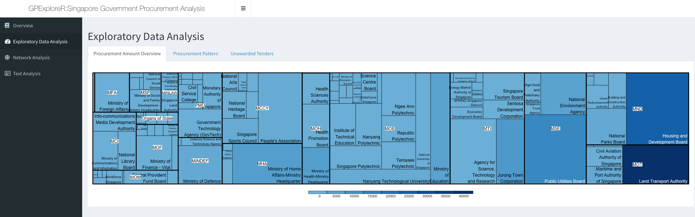
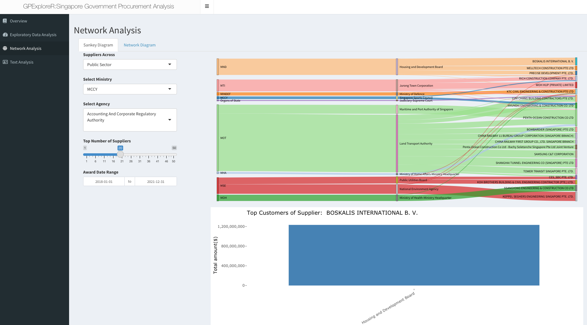
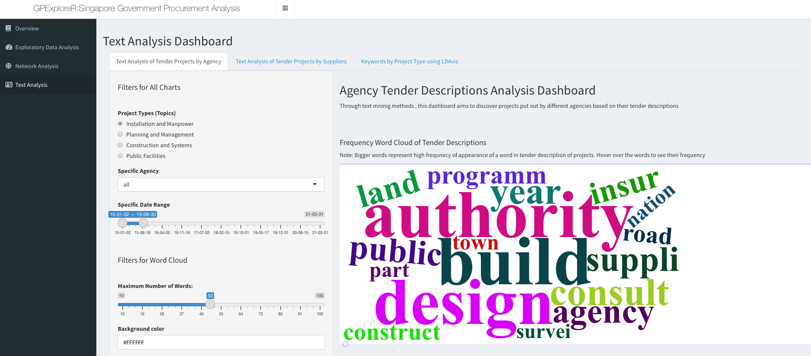

```{r setup, include=FALSE}
knitr::opts_chunk$set(echo = FALSE)
```

# Project Deliverable

```{r}
htmltools::HTML('<ul>
                <li><a href=attachments/UserGuidePDF.pdf> User Guide</a></li>
                <li><a href=attachments/PosterPDF.pdf> Poster</a></li>
                <li><a href="https://lostdatafinder.shinyapps.io/Compiled/"> Shiny Application</a></li>
                </ul>')

```

# Project Introduction 

In recent years, there have been high profile cases of public sector procurement fraud and corruption in Singapore. Singapore public sector procurement is mainly done via GeBIZ, an e-procurement portal where public agencies publish invitations for quotations and tenders. For public sector procurement, there is a need to identify areas where there is possible over-reliance on a particular supplier. Such over-reliance could point to risks or possible irregularities that would need to be investigated.​

Currently GeBiz has two separate procurement analytics tools, namely GeBIZ InSIGHT and GeBIZ Management Console (GMC). GeBiz InSIGHT aims at allowing procurement officers to gain insights into the potential procurement opportunities. GeBIZ Management Console (GMC) aims at providing decision makers with visibility of public procurement. Although these tools allow insight gathering for decision making, they are aimed at public sector level. An improvement on this would be making it transparent to the suppliers as well, enabling them to gain insights on potential market opportunities. A single platform consisting of analytics targeted at both supplier and public agencies would also improve the procurement efficiency.​

**The objective of this project is to provide suitable visualizations for users to:​**

- **Exploratory Data Analysis Component:** Conduct exploratory data analysis to gain overall understanding of the procurement pattern of both awarded and un-awarded tenders at ministry or agency levels​



- **Network Analysis Component:** Network analysis to identify the key interactions between public agencies and suppliers, and to identify key suppliers that are heavily relied on by the public sector​



- **Text Analysis Component :** Text mining through word cloud and frequency analysis to identify the common nature of procurement by specific public agency and supplier. Topic modelling was also used to study the salient terms and identify project types from tender description. ​




You may visit our project proposal to get an insightful overview. 
